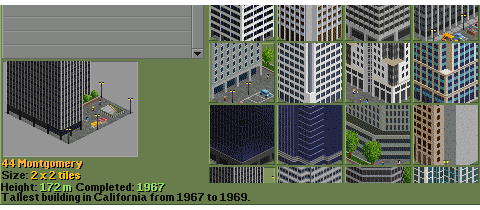
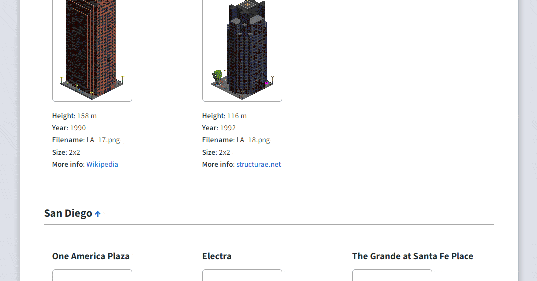
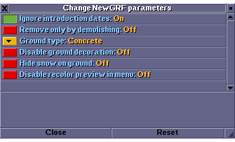
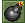
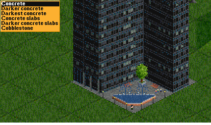
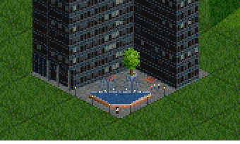
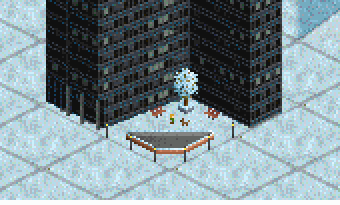

# California Skyscrapers as Objects

California Skyscrapers offer a variety of **real-life California buildings** from Los Angeles, San Diego and San Francisco, that can be used as decorative objects. Each building comes with accurate stats and occasional trivia.

### Features

- All buildings have **snow sprites**
- Construction can be **restricted** to real completion dates
- Greenery, pedestrians, cars and other **decoration** add detail to the buildings
- **Ground type** selection and other **customization** via parameters
- Real-world **stats** and occasional trivia in the description

### Compatibility with _Generic Skyscraper Objects Set_

This is a remake of the original Generic Skyscraper Objects Set by CaptainKlutz and it is released and uploaded to _BaNaNaS (in-game content downloader)_ as a standalone NewGRF. 
There is also a variant of this set that works as a **drop-in replacement** for the Generic Skyscraper Objects Set, effectively serving as its regular **update**.

To keep things organized, the alternative compatibility version is distributed as a separate, dedicated <a href="https://github.com/chujo-chujo/California-Skyscrapers-as-Objects/releases/tag/v1.0-compat" target="_blank">Github release</a>, and you can download it here:

👉&ensp;<a href="https://github.com/chujo-chujo/California-Skyscrapers-as-Objects/releases/download/v1.0-compat/Generic_Skyscraper_Objects_Set-0.2.tar"><strong>Generic_Skyscraper_Objects_Set-0.2.tar</strong></a>

**Setup** 
1. Place the `.tar` package in your OpenTTD directory, (e.g. `...\Users\<USERNAME>\Documents\OpenTTD\newgrf`). 
2. Enable the NewGRF in the OpenTTD settings + configure [parameters](#parameters) as needed. 

## Gallery

To browse the complete set and its details, visit&ensp;👉&ensp;<a href="https://chujo-chujo.github.io/California-Skyscrapers-as-Objects" target="_blank">**GALLERY**</a>

## Parameters

**Ignore introduction dates** 
The buildings in this set have predefined introduction dates based on the real date of their construction. Enable this parameter to ignore the dates.

**Remove only by demolishing** 
If you enable this parameter, only the demolish tool ( or ) can be used to remove an object. Otherwise, objects can be removed by building over them.

**Ground type** 
You can select the style of ground tiles from 6 variants:

_Concrete_, _Darker concrete_, _Darkest concrete_, _Concrete slabs_, _Darker concrete slabs_, _Cobblestone_

**Disable ground decoration** 
You can disable the extra objects placed around buildings, such as trees, benches, vehicles, pedestrians, etc. to keep the graphics similar to _California City Set_.

**Hide snow on ground** 
Controls whether snow appears on concrete around buildings.

**Disable recolor preview in menu** 
Some buildings have recolorable elements, whose variants are previewed in the purchase menu at regular intervals. 
Use this parameter to turn off the automatic recoloring.

## Credits

- Original _California City Set_ by **Luxtram**
- Original _Generic Skyscraper Objects Set_ by **CaptainKlutz**
- Updated and recoded by **chujo**
- With some decor elements borrowed from **Mrsunman's** _AEC_ and **Zephyris'** _Full English_.

## License

The combined work, including modifications and additions, is licensed under the **GNU General Public License v2.0**.
